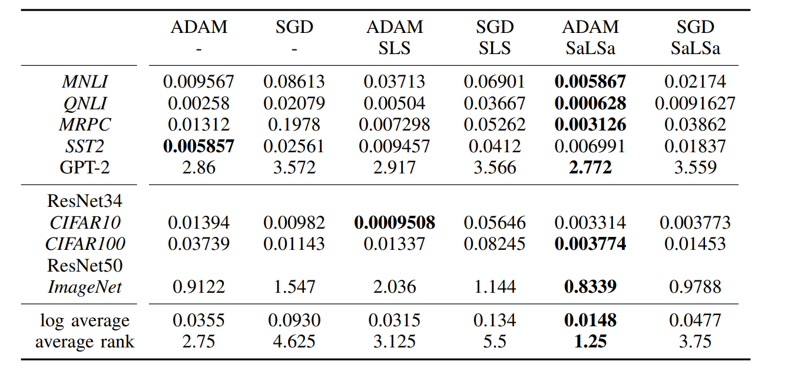

# No learning rates needed: Introducing SALSA - Stable Armijo Line Search Adaptation

The Repository to the Paper Faster Convergence for No learning rates needed: Introducing SALSA - Stable Armijo Line Search Adaptation

Youtube Link:

[](https://www.youtube.com/watch?v=EttProDnEDY)


## Install
Download the repo and use:

```
pip install .
```

Dependencies:

- [pytorch](https://pytorch.org) <3
- [numpy](https://numpy.org/install/) <3


for replicating the results (not needed for using the optimizer):
- `pip install transformers` for huggingface transformers <3 
- `pip install datasets` for huggingface datasets <3 
- `pip install tensorflow-datasets` for tensorflow datasets <3 
- `pip install wandb` for optional logging <3
- for easy replication use conda and environment.yml eg:
`$ conda env create -f environment.yml` and `$ conda activate sls3`


## Use in own projects

The custom optimizer is in \salsa\SaLSA.py and the comparison version are in \salsa\adam_sls.py \\
Example Usage:

```
from salsa.SaLSA import SaLSA
self.optimizer = SaLSA(model.parameters())
```


The typical pytorch forward pass needs to be changed from :
``` 
optimizer.zero_grad()
y_pred = model(x)
loss = criterion(y_pred, y)    
loss.backward()
optimizer.step()
scheduler.step() 
```
to:
``` 
def closure(backwards = False):
    y_pred = model(x)
    loss = criterion(y_pred, y)
    if backwards: loss.backward()
    return loss
optimizer.zero_grad()
loss = optimizer.step(closure = closure)
```

This code change is necessary since, the optimizers needs to perform additional forward passes and thus needs to have the forward pass encapsulated in a function.
See embedder.py in the fit() method for more details


## Replicating Results
The results of the Line Search Algorithm are:



on average a 50\% reduction in final loss, while only needing about 3\% extra compute time on average.


For replicating the main Results of the Paper run:

```
$ python test/run_multiple.py
$ python test/run_multiple_img.py
```


For replicating specific runs or trying out different hyperparameters use:

```
$ python test/main.py 
```

and change the test/config.json file appropriately

## Older Versions of this Optimizer:
https://github.com/TheMody/Faster-Convergence-for-Transformer-Fine-tuning-with-Line-Search-Methods
https://github.com/TheMody/Improving-Line-Search-Methods-for-Large-Scale-Neural-Network-Training


## Please cite:
No learning rates needed: Introducing SALSA - Stable ArmijoLine Search Adaptation
from 
Philip Kenneweg,
Tristan Kenneweg,
Fabian Fumagalli
Barbara Hammer
to be published in IJCNN 2024

the citation may change slightly when the IJCNN 2024 conference is finished

``` 
@inproceedings{pkenneweg2024Salsa,
  author    = {Kenneweg, Philip and Kenneweg, Tristan and Fabian Fumagalli and Hammer, Barbara},
  title     = {No learning rates needed: Introducing SALSA - Stable Armijo Line Search Adaptation},
  journal   = {IJCNN},
  year      = {2024},
}
```

